<p align="center">
  
</p>

<h1 align="center">Candela</h1>

<p align="center">
  <strong>Light themes for tired eyes</strong>
</p>

<p align="center">
  14 light color themes for terminals and editors, plus two dark companions.
  For people who like dark mode but can't use it comfortably: prescription lenses,
  astigmatism, glare sensitivity, plain eye strain. Candela keeps the calm
  feel of a good pastel dark theme — on paper instead of pitch black.
</p>

<p align="center">
  <a href="https://github.com/schovi/candela-themes/actions/workflows/ci.yml"></a>
  <a href="https://candela.ink"></a>
  <a href="LICENSE"></a>
</p>

<p align="center">
  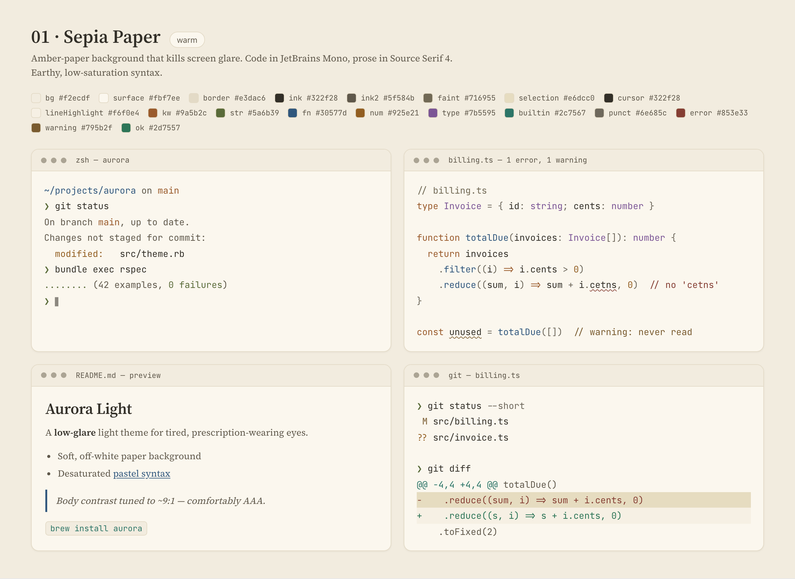
</p>

<p align="center">
  <strong><a href="https://candela.ink">Browse every theme live at candela.ink</a></strong> — no clone needed.<br>
  All 16 themes are in the <a href="#gallery">gallery below</a>; the design rules live in
  <a href="AGENTS.md">AGENTS.md</a>, the vision science in <a href="docs/vision-research.md">docs/vision-research.md</a>.
</p>

## Why most light themes hurt

They're usually too bright and too saturated. Candela follows a few rules to fix
that:

1. **Off-white backgrounds, never pure white.** Pure white glares. Soft tinted
   paper (`bg`, with panels a shade lighter in `surface`) doesn't.
2. **Dark gray text, never pure black.** Candela inks are very dark but never
   `#000`. Dark gray on off-white just reads calmer for a lot of people.
3. **Strong contrast, not maximal.** Body text (`ink` on `surface`) clears WCAG
   AAA (7:1+). Secondary text (`ink2`) and comments (`faint`) step down but
   still clear WCAG AA (4.5:1 against `bg`, the surface terminals paint on).
4. **Low-saturation colors.** Saturated text is what causes the colored fringing
   astigmatic eyes see. Desaturating the accents is the fix.
5. **Blue and orange carry the meaning.** They stay distinct for almost all types
   of color blindness, so keywords, strings, and functions don't blur together.
6. **Same colors mean the same thing in every theme,** so switching never makes
   you relearn what you're looking at.

Each rule is explained (with sources, and where common advice gets it wrong) in
[`docs/vision-research.md`](docs/vision-research.md).

## The 16 themes

Themes 01–10 are the main palettes, from calm neutrals to stronger pastels.
11–14 are experiments, each built around one idea. 15–16 are dark themes,
extracted from iTerm favorites and tuned to the same contrast invariants.

| # | Name | Tone | Code font | Prose font |
| --- | --- | --- | --- | --- |
| 01 | Sepia Paper | Warm | JetBrains Mono | Source Serif 4 |
| 02 | Slate Mist | Cool | IBM Plex Mono | IBM Plex Sans |
| 03 | Sage | Neutral (low-vision) | Fira Code | Atkinson Hyperlegible |
| 04 | Solarized Lite | Warm classic | Source Code Pro | Newsreader |
| 05 | Blossom | Pastel rose | DM Mono | DM Sans |
| 06 | Lagoon | Cool aqua | Space Mono | Work Sans |
| 07 | Meadow | Fresh green | Spline Sans Mono | Spline Sans |
| 08 | Apricot | Warm peach | Red Hat Mono | Hanken Grotesk |
| 09 | Periwinkle | Pastel indigo | Roboto Mono | Public Sans |
| 10 | Ink & Coral | High-contrast | Overpass Mono | Lora |
| 11 | Graphite Mono | *One accent* (near-monochrome) | IBM Plex Mono | IBM Plex Sans |
| 12 | Tungsten | *Low blue light* (evening) | JetBrains Mono | Source Serif 4 |
| 13 | E-Ink Slate | *Reflective paper* (ultra-low chroma) | Fira Code | Atkinson Hyperlegible |
| 14 | Contrast Max | *Acuity first* (maximal legibility) | Overpass Mono | Lora |
| 15 | Nocturne | *Dark* (One Dark heritage) | JetBrains Mono | Public Sans |
| 16 | Borealis | *Dark* (pastel) | DM Mono | DM Sans |

What each experiment asks:

- **Graphite Mono** — what if almost everything is gray and one blue does the
  work? (fewest color fringes)
- **Tungsten** — what if we drop blue light for evening use, like a warm bulb?
  (better for sleep; blue light doesn't cause eye strain, see the research doc)
- **E-Ink Slate** — what if syntax is nearly grayscale, like a Kindle? (no glow)
- **Contrast Max** — what if sharpness, not glare, is your limit? (deep accents,
  near-white paper)

And two dark themes, for when you do want the lights off:

- **Nocturne** — Atom's classic One Dark, the palette a generation of developers
  grew up on, with accents lifted just enough to clear AA on the dark ground.
- **Borealis** — near-black charcoal under soft candy accents (teal, lilac,
  coral), like the northern lights the set is named for.

## Gallery

Each shot is one theme across a terminal, Ruby, Kotlin, Markdown, and
diagnostics, from the theme explorer (`app/`). Regenerate with
`npm run app:screenshots` (see [`docs/screenshots/README.md`](docs/screenshots/README.md)).

| | |
| --- | --- |
| **01 · Sepia Paper**<br> | **02 · Slate Mist**<br>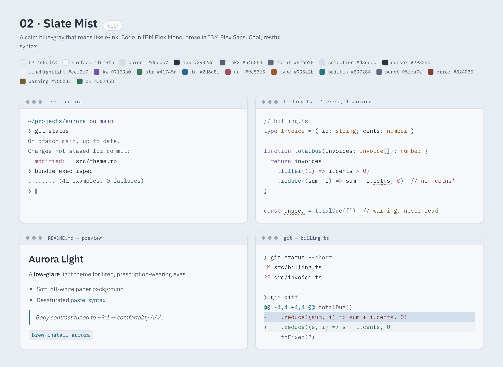 |
| **03 · Sage**<br>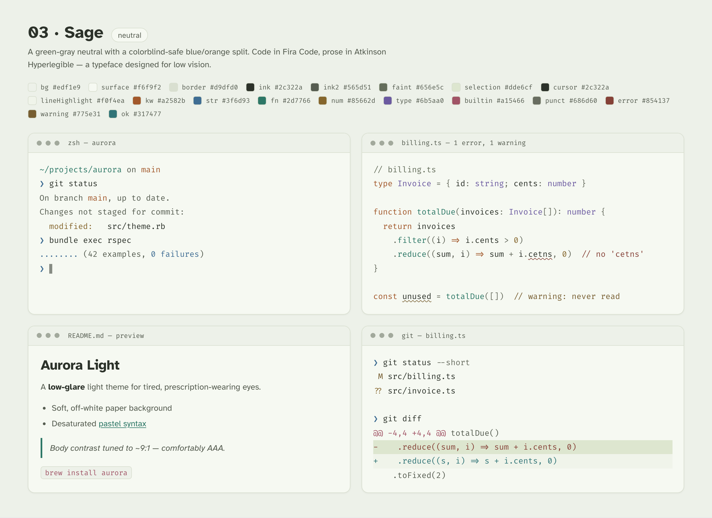 | **04 · Solarized Lite**<br>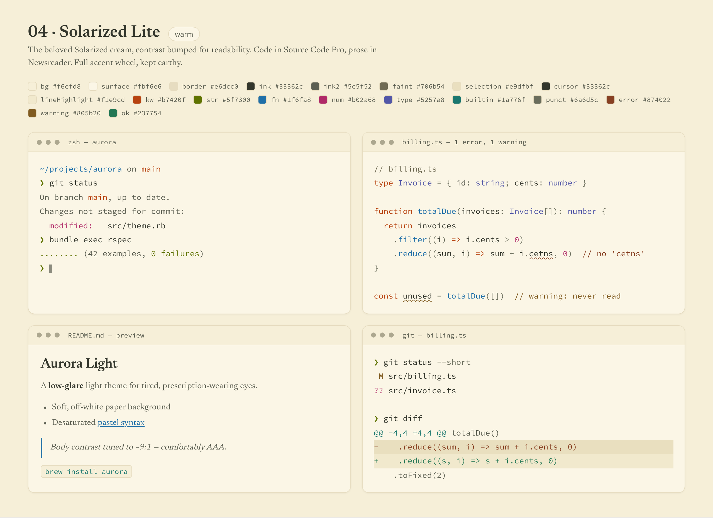 |
| **05 · Blossom**<br>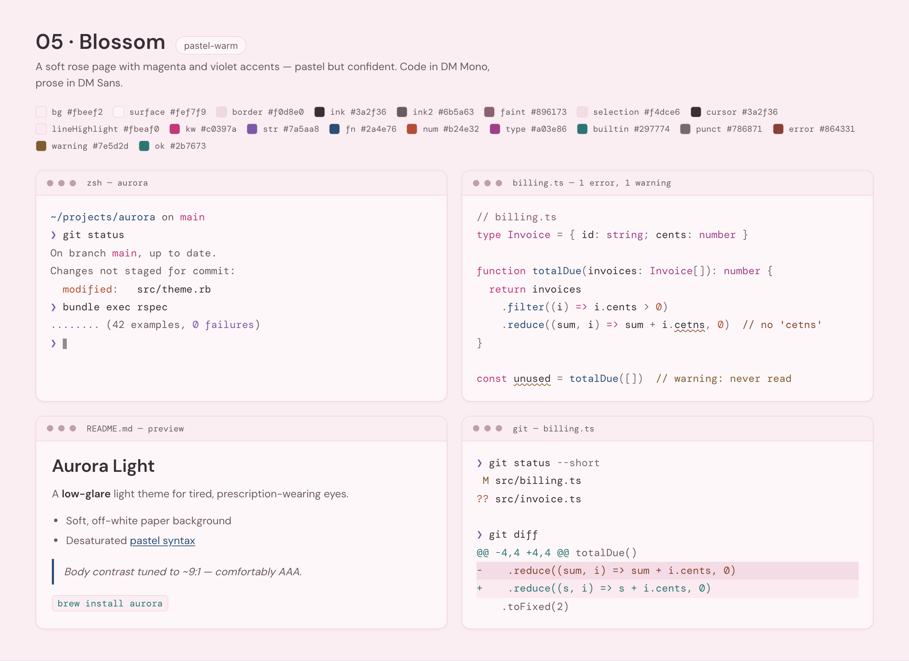 | **06 · Lagoon**<br>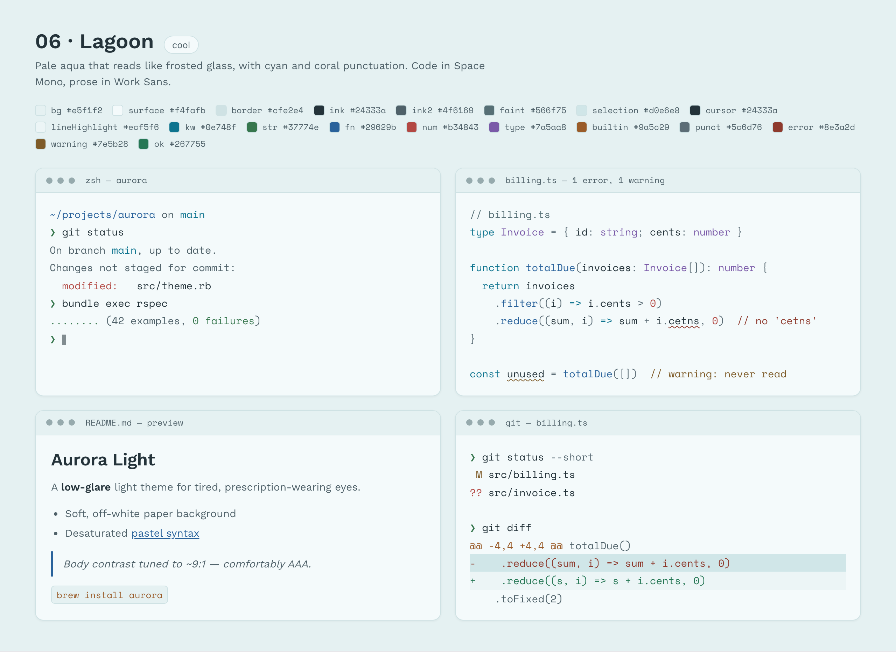 |
| **07 · Meadow**<br>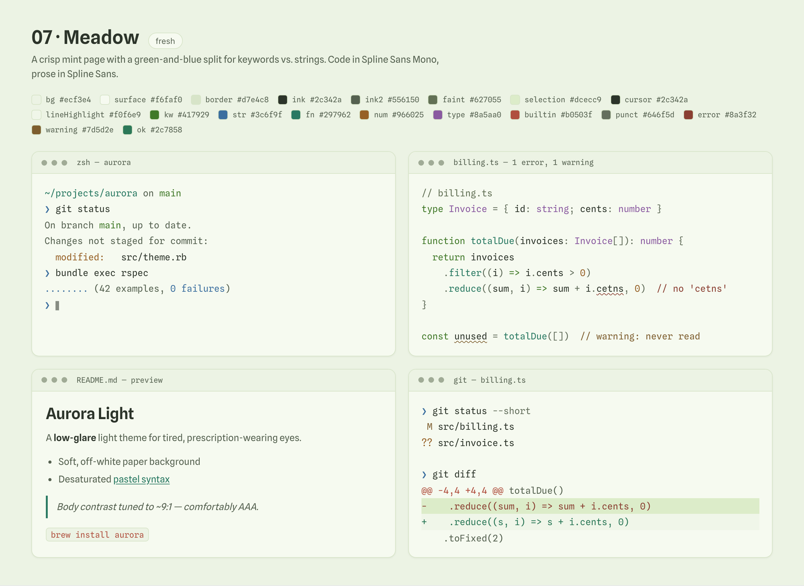 | **08 · Apricot**<br>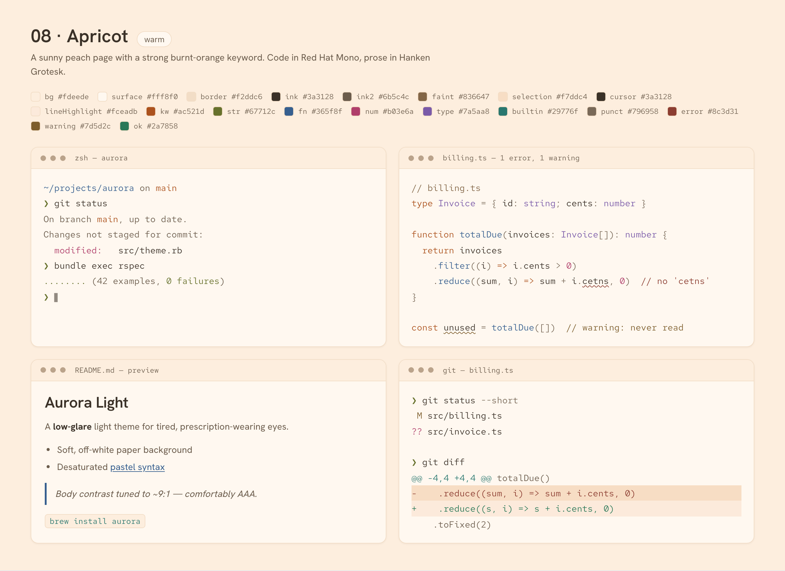 |
| **09 · Periwinkle**<br> | **10 · Ink & Coral**<br>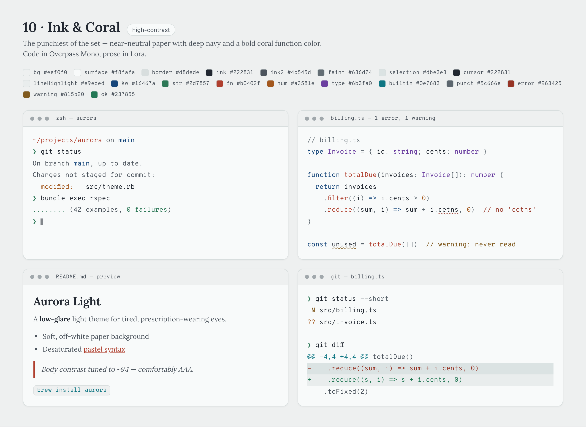 |
| **11 · Graphite Mono**<br> | **12 · Tungsten**<br> |
| **13 · E-Ink Slate**<br>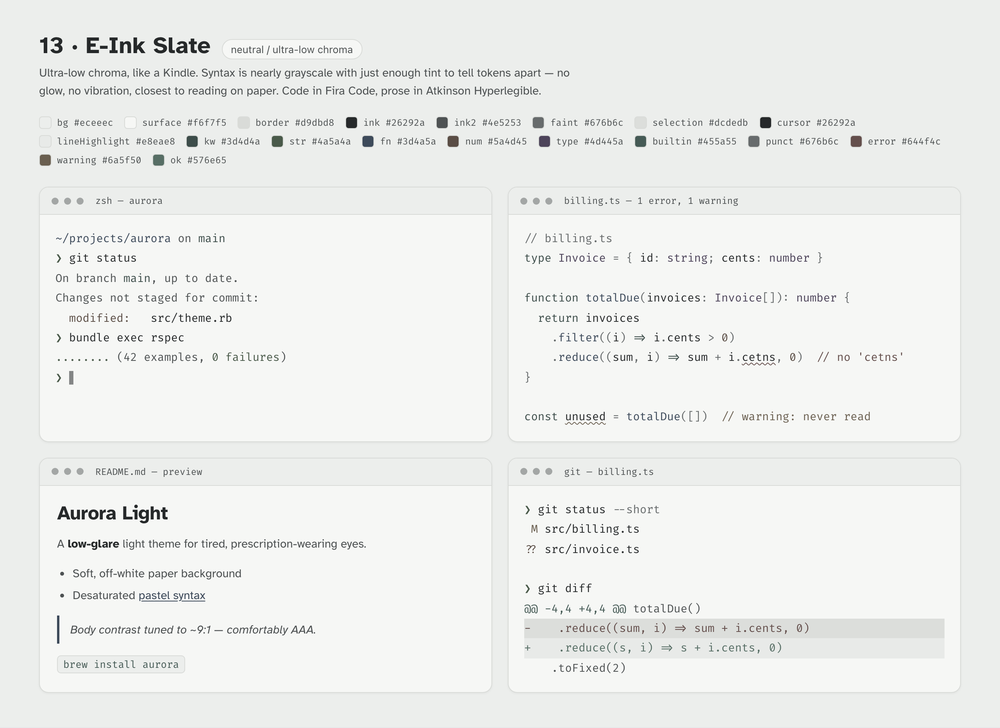 | **14 · Contrast Max**<br>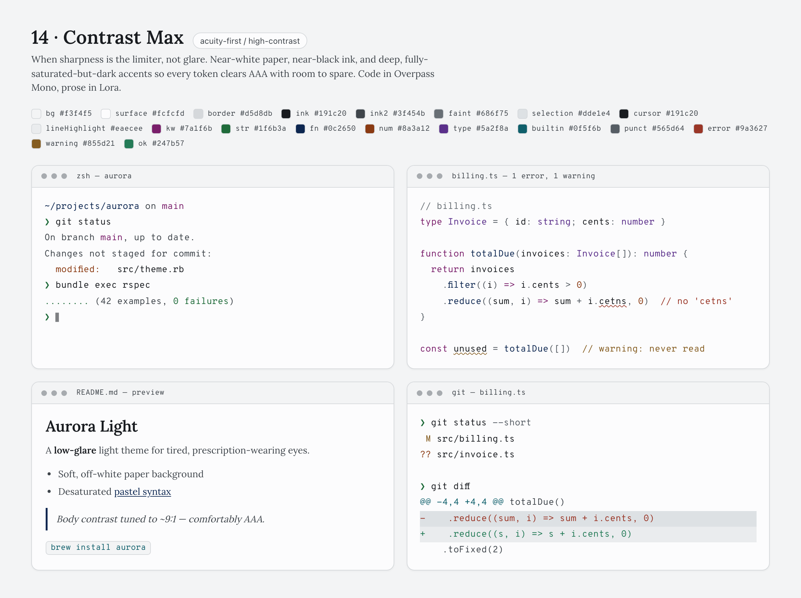 |
| **15 · Nocturne**<br>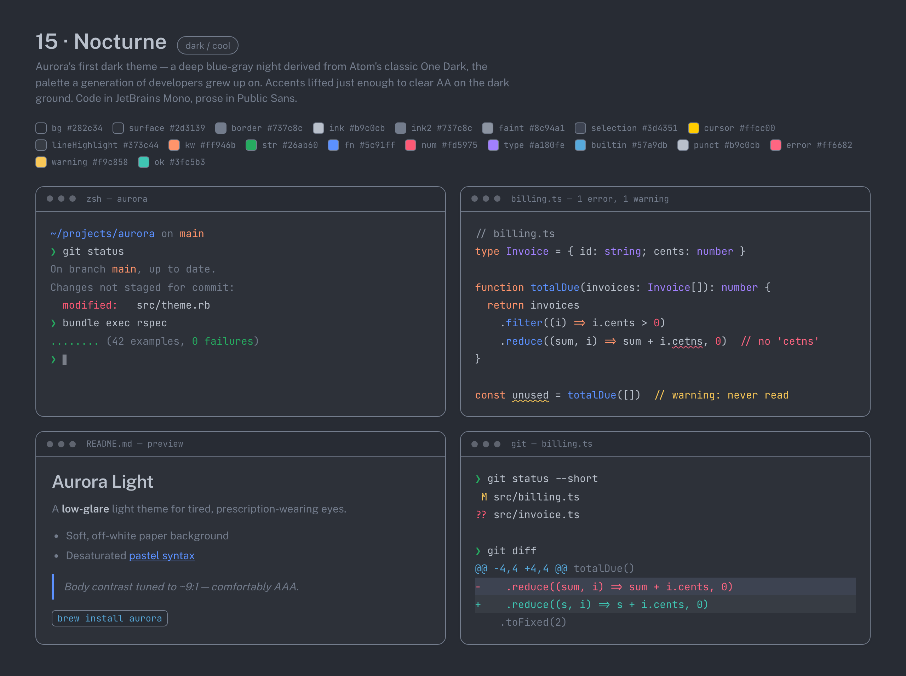 | **16 · Borealis**<br>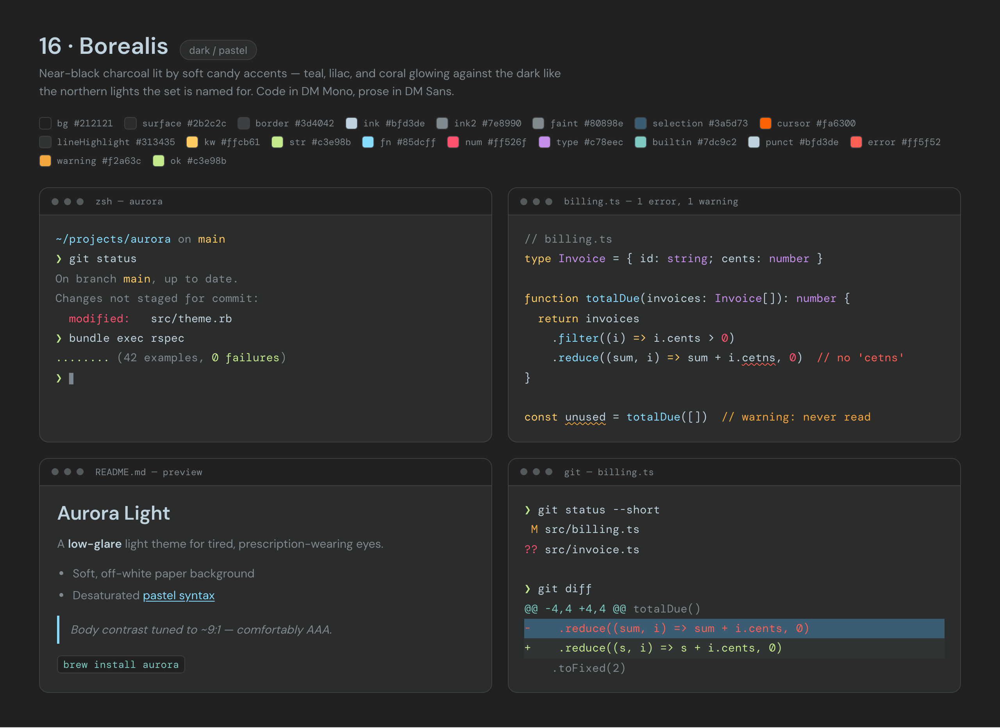 |

## Install

```sh
git clone https://github.com/schovi/candela-themes && cd candela-themes
npm run build   # or: node scripts/generate.js — no dependencies needed
```

This generates every theme under `build/`. Grab the file your tool needs from
`build/<tool>/`, or install the VS Code `.vsix` (below). `build/` and `dist/` are
generated, not committed.

Theme ids: `sepia-paper`, `slate-mist`, `sage`, `solarized-lite`, `blossom`,
`lagoon`, `meadow`, `apricot`, `periwinkle`, `ink-coral`, `graphite-mono`,
`tungsten`, `eink-slate`, `contrast-max`, `nocturne`, `borealis`.

### iTerm2

1. iTerm2 → **Settings → Profiles → Colors**.
2. **Color Presets… → Import…** and pick a file from `build/iterm2/`, e.g.
   `candela-sepia-paper.itermcolors`.
3. Open **Color Presets…** again and select it (it appears as *candela-…*).

### VS Code

Run `npm run package` to rebuild every theme and create all supported packages.
The format-specific commands below remain available when only one package is needed.

The generated extension (all 16 themes) lives at `build/vscode/`.

- **As a `.vsix` (recommended):** `npm run package:vscode` builds and packages it
  into `dist/candela-themes-<version>.vsix`, then **Extensions → ⋯ → Install from
  VSIX…** on that file.
- **From source:** copy `build/vscode/` into `~/.vscode/extensions/candela-themes/`
  and reload, or open the folder in VS Code and press **F5**.

Then **Preferences: Color Theme** and pick any *Candela NN · …* entry.

### IntelliJ / JetBrains IDEs

The theme plugin (all 16 themes) is generated at `build/intellij/`. Each theme
ships an editor color scheme (as `.xml`, which the plugin's `editorScheme`
loads, plus an identical `.icls` for manual import) and a UI theme
(`.theme.json`).

- **As a plugin zip (recommended):** install JDK 17+ and Gradle 9+, then run
  `npm run package:intellij`. This regenerates the plugin, runs `buildPlugin`, and
  writes `dist/candela-themes-intellij-<version>.zip`. In the IDE, choose
  **Settings → Plugins → ⚙ → Install Plugin from Disk…** and select the zip.
- **Editor scheme only:** **Settings → Editor → Color Scheme → ⚙ → Import
  Scheme…** and pick an `.icls` from `build/intellij/src/main/resources/themes/`.
- **From source:** run Gradle's `buildPlugin` task in `build/intellij/`, install
  the resulting zip, then
  **Settings → Appearance & Behavior → Appearance → Theme** and pick a Candela
  theme.

The generated plugin does not yet include a Marketplace icon.

### Other terminals

The same ANSI palette is generated for six terminals. Pick your file and import
per that terminal's docs:

Run `npm run package:bundles` to regenerate the themes and create one release
archive per terminal under `dist/`. Each archive contains all 16 theme files and
short installation instructions; loose files remain available under `build/`.

| Terminal | File |
| --- | --- |
| iTerm2 | `build/iterm2/candela-<id>.itermcolors` |
| Alacritty | `build/alacritty/candela-<id>.toml` |
| Kitty | `build/kitty/candela-<id>.conf` |
| WezTerm | `build/wezterm/candela-<id>.toml` |
| Windows Terminal | `build/windows-terminal/candela-<id>.json` (fragment) |
| Ghostty | `build/ghostty/candela-<id>.conf` |

### Zed

The generated extension (all 16 themes) lives at `build/zed/`. In Zed, open
**Extensions**, choose **Install Dev Extension**, and select that directory.
`npm run package:zed` copies the complete extension to `dist/zed/` for sharing or
installation the same way. Registry publishing is a follow-up.

### Sublime Text

Run `npm run package:sublime`, then copy
`dist/candela-themes.sublime-package` into Sublime Text's `Installed Packages/`
folder. For a loose-file install, copy the `.sublime-color-scheme` files from
`build/sublime/` into `Packages/User/`. Package Control publishing is a follow-up.

### Neovim

The generated plugin (all 16 themes) lives at `build/nvim/`. Extract the release
archive and point lazy.nvim or packer at that local plugin directory, or copy its
`colors/` directory onto your runtimepath. Then run `:colorscheme
candela-sepia-paper` (or another theme id). `npm run package:nvim` writes the
release archive to `dist/candela-themes-nvim-<version>.tar.gz`.

### Helix

Drop-in files for all 16 themes live under `build/helix/`. Install them per
Helix's documentation. Run `npm run package:bundles` to regenerate the themes
and create `dist/candela-themes-helix-<version>.tar.gz`, containing all 16 files
and installation instructions.

## How themes are generated

`themes/candela-themes.json` is the source of truth. `scripts/generate.js` (Node,
no dependencies) reads each theme's `colors` block and emits whatever each tool
needs:

```json
{
  "themes": [
    {
      "id": "sepia-paper",
      "name": "01 · Sepia Paper",
      "tone": "warm",
      "tags": ["warm"],
      "mode": "light",
      "fonts": { "code": "JetBrains Mono", "prose": "Source Serif 4" },
      "colors": { "bg": "#f2ecdf", "surface": "#fbf7ee", "ink": "#322f28", ... }
    }
  ],
  "ansiMapping": { ... }
}
```

Every entry declares `mode` (`"light"` or `"dark"`) and a non-empty `tags` array —
both required and validated (`node scripts/validate.js` fails a theme missing either).
`mode` drives the gallery's light/dark filter; `tags` drive its tag filter, where each
theme carries the atomic tags behind its `tone` label (so `pastel-cool` is `["pastel",
"cool"]` and selecting `cool` matches it alongside `dark / cool`).

Build from the repo root:

```sh
npm run build   # or: node scripts/generate.js
```

It wipes and rewrites `build/`, emitting one file per theme per tool at
`build/<tool>/<theme-id>.<ext>`. Output is deterministic (re-running gives
byte-identical files). Hex helpers live in `lib/colors.js`; pure per-format emitters
and their install manuals live in `lib/emitters.js`. The Node generator is only the
filesystem shell, while the browser editor calls the same emitters for downloads.

The tables below are the token → format mappings each emitter uses.

### Terminal (ANSI 16-color)

The top-level `ansiMapping` block maps tokens to the 16 ANSI slots, plus
`background = bg`, `foreground = ink`, `cursor = cursor`,
`selectionBackground = selection`. It's one sensible default (e.g. `yellow → kw`,
`red → num`); change it once and all six terminal formats regenerate.

### Editors — TextMate scopes (VS Code, Sublime)

UI tokens map to the editor's UI keys (`editor.background = surface`,
`editor.foreground = ink`, `editorLineHighlightBackground = lineHighlight`, …);
syntax tokens map to `tokenColors` scopes:

| Candela token | TextMate scope(s) |
| --- | --- |
| `kw` | `keyword`, `storage` |
| `str` | `string` |
| `fn` | `entity.name.function`, `support.function` |
| `num` | `constant.numeric`, `constant.language` |
| `type` | `entity.name.type`, `entity.name.class`, `support.type` |
| `builtin` | `support`, `variable.language`, `constant.other.symbol` |
| `punct` | `punctuation`, `keyword.operator` |
| `faint` | `comment` |

The VS Code emitter writes a complete, vsix-ready extension at `build/vscode/`:
one `package.json` contributing all 16 themes and one
`themes/candela-<id>-color-theme.json` per theme (`"type": "light"`, workbench
`colors{}` + `tokenColors[]`). The whole workbench is themed (activity bar, side
bar, tabs, status bar, panels, integrated terminal), not just the editor pane.
`package.json` carries full Marketplace metadata (placeholder `CHANGEME` URLs
until a real repo exists), and the emitter also drops a bundled `README.md`, a
`.vscodeignore`, and a copy of the root MIT `LICENSE` so packaging is
warning-free (no `icon` yet, needs a 128px PNG).

Sublime reuses the same scope table. Its emitter writes a complete package
directory at `build/sublime/`: one `candela-<id>.sublime-color-scheme` per theme,
a bundled README, and a Package Control install message. `npm run
package:sublime` regenerates that directory and uses the system `zip` command to
create `dist/candela-themes.sublime-package`; packaging tooling stays separate
from the generator's zero-runtime-dependency path.

### JetBrains / IntelliJ

`build/intellij/` is a complete IntelliJ Platform Gradle project. Its emitted
`build.gradle.kts` and `settings.gradle.kts` use `buildPlugin` to package the
resources. Per theme: an editor color scheme (emitted twice with identical
content — `.xml`, which the plugin's `editorScheme` loads, and `.icls` for the
manual Import Scheme dialog) and a UI theme `.theme.json`, plus one
`META-INF/plugin.xml` registering all 16 as `themeProvider` extensions. Two hex
conventions: **the scheme XML drops the leading `#`** (`value="9a5b2c"`);
**`.theme.json` keeps it** (`"#9a5b2c"`).

`.icls` general editor colors and the editor background/foreground:

| Candela token | `.icls` key | Section |
| --- | --- | --- |
| `surface` | `TEXT` → `BACKGROUND` | `<attributes>` |
| `ink` | `TEXT` → `FOREGROUND` | `<attributes>` |
| `cursor` | `CARET_COLOR` | `<colors>` |
| `lineHighlight` | `CARET_ROW_COLOR` | `<colors>` |
| `selection` | `SELECTION_BACKGROUND` | `<colors>` |
| `ink2` | `LINE_NUMBERS_COLOR` | `<colors>` |
| `border` | `GUTTER_BACKGROUND`, `INDENT_GUIDE` | `<colors>` |

`.icls` syntax attributes (`FOREGROUND` per key):

| Candela token | `.icls` attribute key(s) |
| --- | --- |
| `kw` | `DEFAULT_KEYWORD` |
| `str` | `DEFAULT_STRING` |
| `fn` | `DEFAULT_FUNCTION_DECLARATION` |
| `num` | `DEFAULT_NUMBER` |
| `type` | `DEFAULT_CLASS_NAME` |
| `builtin` | `DEFAULT_CONSTANT`, `DEFAULT_METADATA` |
| `punct` | `DEFAULT_OPERATION_SIGN`, `DEFAULT_BRACES`, `DEFAULT_DOT` |
| `faint` | `DEFAULT_LINE_COMMENT`, `DEFAULT_BLOCK_COMMENT` |
| `error` | `ERRORS_ATTRIBUTES` (`EFFECT_COLOR` + `ERROR_STRIPE_COLOR`, wavy) |
| `warning` | `WARNING_ATTRIBUTES` (`EFFECT_COLOR` + `ERROR_STRIPE_COLOR`, wavy) |

Each `.theme.json` sets `dark` from the theme's `mode` (dark themes also inherit
`parent_scheme="Darcula"` in the scheme XML so unstyled editor attributes fall
back dark), points `editorScheme` at its `.xml`, and carries a modest `ui{}`
frame (backgrounds from `bg`/`surface`, borders from `border`, text from
`ink`/`ink2`/`faint`, accents from `fn`).

### Zed, Neovim, Helix

- **Zed** → `build/zed/`, a theme extension with an `extension.toml` manifest
  and one theme *family* at `themes/candela.json` (`$schema` v0.2.0,
  `themes[]`), each entry `appearance: "light"`. UI keys map
  `editor.background = surface`, `editor.foreground = ink`,
  `editor.active_line.background = lineHighlight`,
  `text/text.muted/text.placeholder = ink/ink2/faint`, `border = border`,
  `players[0] = {cursor, selection}`; `style.syntax{}` maps `keyword→kw`,
  `string→str`, `function→fn`, `number/constant→num`, `type/constructor→type`,
  `variable.special/attribute→builtin`, `operator/punctuation→punct`,
  `comment→faint`; `terminal.ansi.*` reuses `ansiMapping`.
- **Neovim** → `build/nvim/colors/candela-<id>.lua`, a self-contained Lua colorscheme
  (loads with `:colorscheme candela-<id>`, no plugins). Sets
  `vim.o.background = 'light'`, legacy highlight groups (`Keyword→kw`,
  `String→str`, `Function→fn`, `Number/Constant→num`, `Type→type`,
  `PreProc/Special→builtin`, `Operator/Delimiter→punct`, `Comment→faint` italic,
  `Normal = ink on bg`, `Visual = selection`, `CursorLine = lineHighlight`).
  Neovim links Treesitter groups to these by default. Plus the 16
  `vim.g.terminal_color_N` slots from `ansiMapping`. The generated plugin root
  also includes a README with plugin-manager and manual installation instructions.
- **Helix** → `build/helix/candela-<id>.toml`, a `[palette]` table of every token
  with top-level scope keys: `ui.background = bg`, `ui.text = ink`,
  `ui.cursor = {fg=bg, bg=cursor}`, `ui.selection = {bg=selection}`,
  `ui.cursorline = {bg=lineHighlight}`, `ui.linenr = ink2`; syntax `keyword→kw`,
  `string→str`, `function→fn`, `constant[.numeric]→num`, `type→type`,
  `variable.builtin/label→builtin`, `punctuation/operator→punct`, `comment→faint`,
  `diagnostic.error/warning → error/warning`.

## Contributing / extending

`themes/candela-themes.json` is the single source of truth. Run `npm run build` to
regenerate `build/` and `npm run validate` to check the design rules. Read
[`AGENTS.md`](AGENTS.md) for the token roles and the rules to preserve when you
add or tweak a theme.

To preview every theme (palette, fonts, sample panes, diagnostics), run the
explorer. First-time setup installs its deps under `app/`:

```sh
cd app && npm install && npx playwright install chromium
```

Then from the repo root, `npm run app` serves the explorer and
`npm run app:screenshots` regenerates the gallery PNGs. See
[`docs/screenshots/README.md`](docs/screenshots/README.md).

The explorer is a static multi-page site (built by Vite, no SPA/router). Its
home page and gallery are pre-rendered into the built HTML, then React hydrates
them for interactivity; the Editor remains client-rendered. The home
page at `/` pitches Candela and indexes every theme, the gallery at
`/themes` shows each theme across sample panes (with a filter bar — fulltext
search over name/tone/tags/fonts, a mode select, and multi-select tag chips — and a per-theme anchor
so any theme is directly linkable, e.g. `/themes#lagoon`; each card also has a
**Customize** action that opens the Editor preloaded with that theme via
`/editor?theme=<id>`). The unified theme tool lives at `/editor`:

- On `/editor` the site header merges with the studio bar into a single full-width app
  bar: the Candela wordmark and nav on one side; on the other the draft name
  (inline-editable, with its id and autosave state), a live status chip — green "all
  checks pass" or red "N checks failing" that jumps to validation — the Simple/Pro
  toggle, and quiet Download draft JSON / Start over actions. Below the bar the editor
  is a full-viewport three-zone workspace — control rail (left) · preview canvas
  (center) · inspector (right) — each zone scrolling independently so the page body
  never scrolls on desktop. Below ~980px the zones collapse to a single scrolling
  column in story order (controls → previews → inspector), usable down to 600px. Before
  a draft exists the app shell still renders, with the four starting cards centered in
  the workspace.
- **Simple** mode derives a palette from background mood, darkness, accent hues,
  and diagnostic hues; the accent wheel is a hue dial rendered at the desaturated
  band guided accents actually ship at, with every syntax token's hue plotted on the
  ring and the selected token + angle read out in the center. **Pro** mode exposes
  hex plus H/S/L per token in compact rows (swatch, name, hex, HSL readout) that
  expand one at a time into sliders. Every slider is a calibrated gauge: channel-true
  gradient track, tick marks, and a numeric readout; lightness tracks keep the
  green pass-zone shading. Theme name lives in the app bar; tone, description,
  and fonts sit behind a Details disclosure at the end of the control rail.
  Both modes edit one browser-local autosaved draft and share configurable preview panes.
  Token controls pair their abbreviations with plain-language labels; hover, keyboard
  focus, and the selected Simple accent highlight matching preview text.
  **Download draft JSON** downloads that working theme for backup or later reopening.
  **Copy link** creates a shareable URL containing the exact draft and editor mode, even
  when hard validation failures block export. Opening one restores the shared draft, or
  asks whether to replace an existing browser draft without hiding or discarding it.
  Damaged links show a notice and fall back normally.
  Global palette helpers are fixed `-50` to `50` controls: each thumb keeps its
  exact value, and the combined palette is recalculated from one stable baseline
  instead of accumulating incremental nudges.
- Export readiness is always visible in the app-bar status chip while detailed hard
  failures, allowed warnings, and per-token contrast values live in the right-hand
  inspector: a **Validation** panel with export as its finale and the Theme JSON as a
  collapsed section below. Hard failures block export; warnings do not. Each result pairs plain adjustment guidance with the
  exact rule output, and both the chip and the blocked-export line jump to the failing
  list. Export is the page's finale: verdict first, then the target-tool download,
  with secondary actions (all-formats zip, Copy theme JSON, Copy link) each captioned;
  when validation flips to all-pass, the status sweeps green (instant under reduced
  motion). The contrast table shows only enforced
  checks, including their required floor and pass/fail status. Colorblind or grayscale
  warnings can switch the preview directly to the relevant vision simulation. The Normal,
  Grayscale, Protan, and Deutan views affect only palette swatches and preview panes, and
  reset to Normal on each load.
  A tool-specific zip contains
  that tool's emitted theme and install manual; the selected tool explains its contents and
  links to installation instructions. The full zip contains every supported format, every
  manual, and the raw theme.
- The editor first offers four starting points: a balanced blank theme, any Candela
  theme, the Simple editor, or a saved JSON draft. A saved draft can be opened only
  as a starting point, and the chooser hides after a selection.
  A saved browser draft opens the editor directly with a resume notice. A valid
  `/editor?theme=<id>` link opens directly unless a draft is present, in which case the
  editor keeps the draft visible until the visitor chooses whether to replace it. Unknown
  theme ids show a notice and fall back to the saved draft or starting-point chooser.
  Confirmed **Start over** clears the browser draft and returns to the chooser. The
  old `/builder` URL redirects to `/editor`.

The editor runs the same invariants as `scripts/validate.js` (shared code in `lib/`), so
**Copy theme JSON** stays disabled until every hard rule passes. Paste the result
into a new `themes[]` entry and it clears `node scripts/validate.js` as-is.

## Publishing the explorer

The explorer is published at **<https://candela.ink>** by **Cloudflare Pages
git integration**: every push to `main` triggers a Cloudflare build of the repo, and
every PR gets a free preview URL (commented on the PR). There is no deploy step in
this repo — Cloudflare owns the build and deploy.

Every publish is **gated on validation**: the Pages build command runs
`node ../scripts/validate.js` before the app build, so malformed source JSON or a
broken design invariant fails the build and nothing ships. GitHub Actions
([`.github/workflows/ci.yml`](.github/workflows/ci.yml)) runs the *same* gate
(JSON validity → `scripts/validate.js` → `cd app && npm ci && npm run build`) on
every PR and push to `main`, so bad changes are caught before merge. Keep the two
in sync — one gate expressed twice. Screenshot regeneration (Playwright) is
deliberately **not** in the pipeline: it is heavy and rewrites committed PNGs; run
it locally when the gallery changes.

The exact Pages settings (project `candela-themes`):

| Setting | Value |
| --- | --- |
| Production branch | `main` |
| Root directory | `app` |
| Build command | `node ../scripts/validate.js && npm run build` |
| Build output directory | `dist` |
| Custom domain | `candela.ink` (proxied apex CNAME → `candela-themes.pages.dev`); `candela.schovi.cz` 301-redirects here via [`app/public/_redirects`](app/public/_redirects) |
| Node version | `NODE_VERSION=20` env var on the project (production + preview); `app/.node-version` pins the same for local tooling |

The project is provisioned and live. If it ever needs re-creating: everything
(project, build config, domain, env vars) is manageable over the Cloudflare API
*except* the **Cloudflare Workers & Pages GitHub App** installation — that is a
browser OAuth flow, done in the dashboard via **Workers & Pages → Create → Pages
→ Connect to Git** (authorize the app for `schovi/candela-themes` from within
that flow; installing it from GitHub's side alone does not link the Cloudflare
account).
